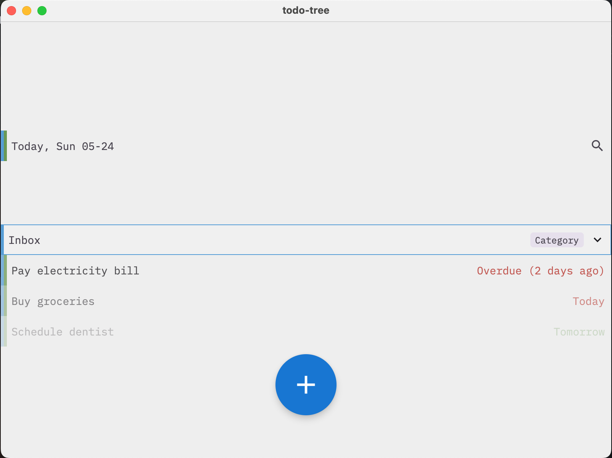
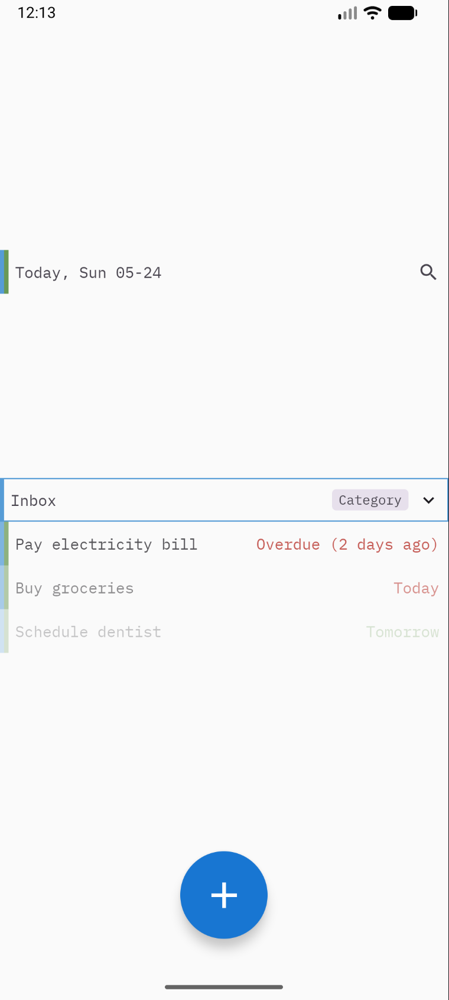

# todo-tree

> **AI-generated code notice:** This project was written with the assistance of a large language model (DeepSeek V4 Flash).

<p>
  
  
</p>

Task manager with infinite nested subtrees, keyboard-first navigation, NLP date parsing, `#` command syntax, swipe actions, and Inbox-centric organization.

## Features

- **Three item types**: Task (swipeable, independent completion), Project (auto-completes when children done), Category (organizational, never completes)
- **NLP date parsing**: `do tomorrow`, `due fri`, `mar 7`, `next week`, `+3d` — relative and absolute dates
- **`#` command syntax**: `#cat`/`#proj` for type, `#removecat` to delete a category, `#moveto` to reparent, `#word` for parent references
- **Fuzzy autocomplete**: Dropdown suggestions with breadcrumbs for `#word`, `#removecat`, `#moveto`
- **Keyboard-first navigation**: Arrow keys, Spacebar (toggle done), Enter (edit), A (add), Backspace/Delete (delete)
- **Swipe actions**: Overlay-style buttons (Done, Wait, Delete) on task rows — peek on swipe, tap to confirm
- **Inline editing**: Tap title to edit task properties (dates, title, item type)
- **Inbox as default**: Stray tasks and unresolved references default to Inbox (immutable category)
- **Custom theming**: Primary colors, IBM Plex Mono typography
- **Record-style FAB**: Large 80dp bottom-center button for adding tasks

## Project Structure

```
shared/src/
├── commonMain/kotlin/com/example/todo_tree/
│   ├── App.kt              # Root composable + MaterialTheme + color scheme
│   ├── TimeUtil.kt         # expect fun currentTimeMillis()
│   ├── model/
│   │   ├── TaskNode.kt     # Core data classes: ItemNode, Item, TaskState
│   │   └── TaskTree.kt     # Immutable tree operations
│   ├── viewmodel/
│   │   └── TaskViewModel.kt # State holder + comprehensive sample forest
│   └── ui/
│       ├── TaskTreeScreen.kt  # Main screen: scroll, keyboard, swipe, add/search, dropdowns
│       ├── TaskTreeItems.kt   # TaskRow, EditingTaskRow, InputTaskRow, TodayBar
│       ├── DateParser.kt      # NLP date parsing, #token scanning, live highlighting
│       ├── Navigation.kt      # Tree traversal, fuzzy search, breadcrumbs, keyboard dispatch
│       ├── SwipeActionsRow.kt # Overlay swipe with directional guard
│       ├── TaskFab.kt         # Single FAB button
│       └── EditTaskSheet.kt   # Modal bottom sheet (legacy)
├── wasmJsMain/             # Wasm-specific (currentTimeMillis impl)
├── jvmMain/                # JVM-specific (currentTimeMillis impl)
├── jvmTest/
├── androidMain/            # Android-specific (currentTimeMillis impl)
└── androidHostTest/
webApp/src/
└── wasmJsMain/kotlin/com/example/todo_tree/
    └── main.kt             # Web entry point
```

## Dependencies

| Package | Version | Purpose | Docs |
|---------|---------|---------|------|
| compose.runtime | `^1.11.0` | Compose runtime (state, effects) | https://developer.android.com/jetpack/androidx/releases/compose-runtime |
| compose.foundation | `^1.11.0` | Layout, gestures, pointer input | https://developer.android.com/jetpack/androidx/releases/compose-foundation |
| compose.material3 | `^1.11.0-alpha07` | Material Design 3 components | https://developer.android.com/jetpack/androidx/releases/compose-material3 |
| compose.ui | `^1.11.0` | Graphics, input, modifiers | https://developer.android.com/jetpack/androidx/releases/compose-ui |
| compose.components.resources | `^1.11.0` | Font bundling via compose resources | https://www.jetbrains.com/help/kotlin-multiplatform-dev/compose-multiplatform-resources.html |
| androidx.lifecycle.viewmodel-compose | `^2.11.0` | ViewModel in Compose | https://developer.android.com/jetpack/androidx/releases/lifecycle |
| androidx.lifecycle.runtime-compose | `^2.11.0` | Lifecycle-aware coroutines | https://developer.android.com/jetpack/androidx/releases/lifecycle |
| material-icons-core | `==1.7.3` | Check, expand/collapse icons | https://developer.android.com/jetpack/androidx/releases/compose-material |
| kotest-property | `^6.1.11` | Property-based testing (Arb, checkAll, shrinking) | https://kotest.io/docs/proptest/property-based-testing.html |

## Command Syntax

| Token | Description |
|-------|-------------|
| `<title>` | Add task as subtask of focused item |
| `#cat` / `#category` | Create as Category type |
| `#proj` / `#project` | Create as Project type |
| `#removecat` / `#rmcat` | Delete a category (shows confirmation) |
| `#moveto` / `#mt` | Move focused item to a target |
| `#<word>` | Set parent reference by title |
| `do <date>` | Set do (start) date |
| `due <date>` | Set due date |
| `<date>` | Set do date (shorthand) |

Supported date expressions: `today`, `tomorrow`, `next week`, `mon`–`sun`, `in 3 days`, `+5d`, `+2w`, `mar 7`, `7 mar`, ordinal (`7th`).

## Running

- **Desktop**: `./gradlew :desktopApp:run`
- **Android**: `./gradlew :androidApp:assembleDebug`
- **Web (Wasm)**: `./gradlew :webApp:wasmJsBrowserDevelopmentRun`

## Tests

Uses **Kotest Property** (`io.kotest:kotest-property`) for property-based testing with built-in generators (Arb), shrinking, and `checkAll`/`forAll` test functions.

### Test structure

```
shared/src/commonTest/kotlin/com/example/todo_tree/
├── Arbs.kt                          — Custom generators (Arb) for trees and commands
├── DateParserTest.kt                — Example-based + invariant tests for NLP parsing
└── model/
    ├── TaskTreePropertyTest.kt      — Property tests for all tree operations
    ├── CommandPropertyTest.kt       — Command roundtrip invariants (ADT correctness)
    └── UndoManagerPropertyTest.kt   — Undo/redo stack behavior
```

### Running

- **Desktop (JVM)**: `./gradlew :shared:jvmTest`
- **Android host**: `./gradlew :shared:testAndroidHostTest`
- **Web (Wasm)**: `./gradlew :shared:wasmJsTest`
