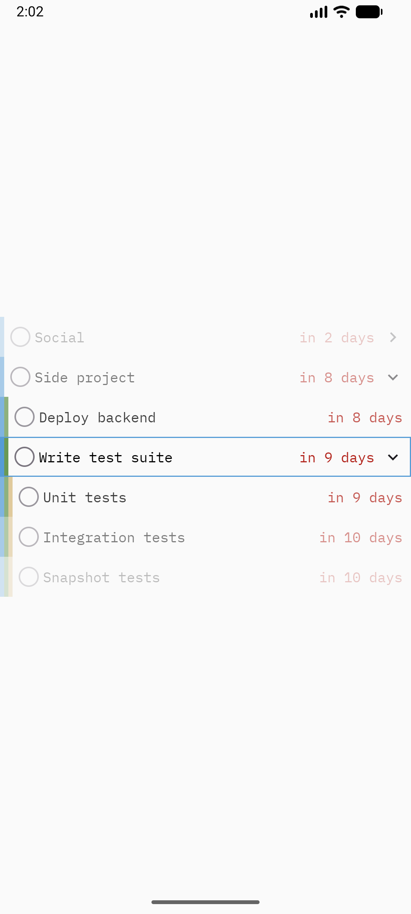

# todo-tree

> **AI-generated code notice:** This project was written with the assistance of a large language model (DeepSeek V4 Flash).



Task manager with infinite nested subtrees, keyboard-first navigation, and due-date constraints.

## Project Structure

```
shared/src/
├── commonMain/kotlin/com/example/todo_tree/
│   ├── App.kt              # Root composable + MaterialTheme
│   ├── TimeUtil.kt         # expect fun currentTimeMillis()
│   ├── model/
│   │   ├── TaskNode.kt     # Core data class
│   │   └── TaskTree.kt     # Immutable tree operations
│   ├── viewmodel/
│   │   └── TaskViewModel.kt # State holder + sample forest
│   └── ui/
│       ├── TaskTreeScreen.kt
│       ├── TaskTreeItems.kt
│       ├── EditTaskSheet.kt
│       └── Navigation.kt
├── wasmJsMain/             # Wasm-specific (currentTimeMillis impl)
├── jvmMain/                # JVM-specific (currentTimeMillis impl)
├── jvmTest/
├── androidMain/            # Android-specific (currentTimeMillis impl)
└── androidHostTest/
webApp/src/
└── wasmJsMain/kotlin/com/example/todo_tree/
    └── main.kt             # Web entry point
```

## Dependencies

| Package | Version | Purpose | Docs |
|---------|---------|---------|------|
| compose.runtime | `^1.11.0` | Compose runtime (state, effects) | https://developer.android.com/jetpack/androidx/releases/compose-runtime |
| compose.foundation | `^1.11.0` | Layout, gestures, pointer input | https://developer.android.com/jetpack/androidx/releases/compose-foundation |
| compose.material3 | `^1.11.0-alpha07` | Material Design 3 components | https://developer.android.com/jetpack/androidx/releases/compose-material3 |
| compose.ui | `^1.11.0` | Graphics, input, modifiers | https://developer.android.com/jetpack/androidx/releases/compose-ui |
| compose.components.resources | `^1.11.0` | Font bundling via compose resources | https://www.jetbrains.com/help/kotlin-multiplatform-dev/compose-multiplatform-resources.html |
| androidx.lifecycle.viewmodel-compose | `^2.11.0` | ViewModel in Compose | https://developer.android.com/jetpack/androidx/releases/lifecycle |
| androidx.lifecycle.runtime-compose | `^2.11.0` | Lifecycle-aware coroutines | https://developer.android.com/jetpack/androidx/releases/lifecycle |
| material-icons-core | `==1.7.3` | Check, expand/collapse icons | https://developer.android.com/jetpack/androidx/releases/compose-material |

## Running

- **Desktop**: `./gradlew :desktopApp:run`
- **Android**: `./gradlew :androidApp:assembleDebug`
- **Web (Wasm)**: `./gradlew :webApp:wasmJsBrowserDevelopmentRun`

## Tests

- **Desktop**: `./gradlew :shared:jvmTest`
- **Android host**: `./gradlew :shared:testAndroidHostTest`
- **Web (Wasm)**: `./gradlew :shared:wasmJsTest`
